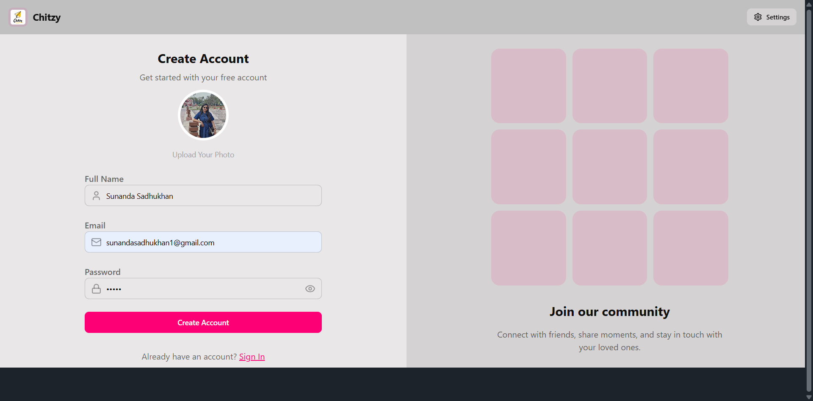
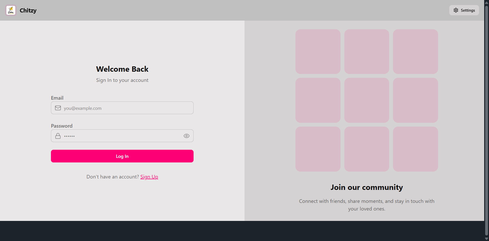
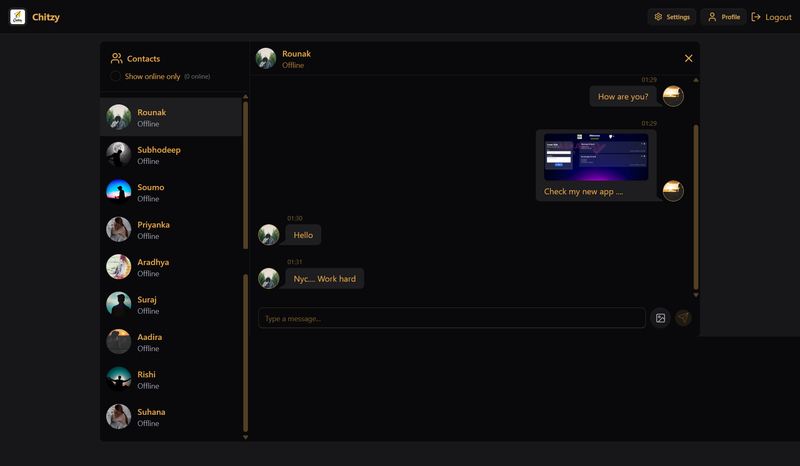
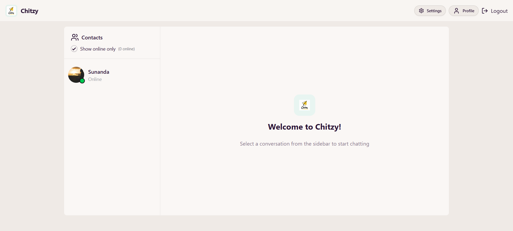
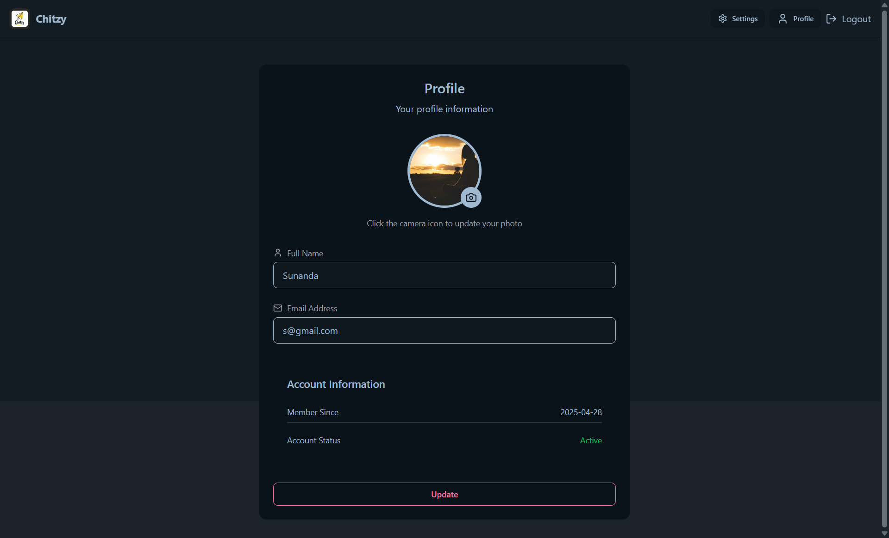
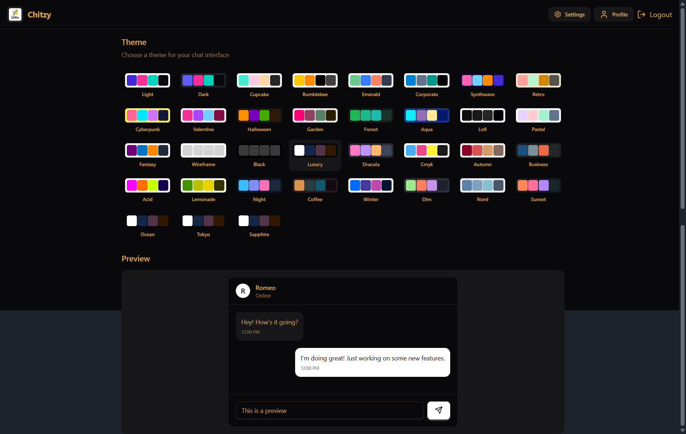

# React + Vite

This template provides a minimal setup to get React working in Vite with HMR and some ESLint rules.

Currently, two official plugins are available:

- [@vitejs/plugin-react](https://github.com/vitejs/vite-plugin-react/blob/main/packages/plugin-react) uses [Babel](https://babeljs.io/) for Fast Refresh
- [@vitejs/plugin-react-swc](https://github.com/vitejs/vite-plugin-react/blob/main/packages/plugin-react-swc) uses [SWC](https://swc.rs/) for Fast Refresh

## Expanding the ESLint configuration

If you are developing a production application, we recommend using TypeScript with type-aware lint rules enabled. Check out the [TS template](https://github.com/vitejs/vite/tree/main/packages/create-vite/template-react-ts) for information on how to integrate TypeScript and [`typescript-eslint`](https://typescript-eslint.io) in your project.

## Backend Repository [https://github.com/Sunanda01/Chitzy_Server.git](https://github.com/Sunanda01/Chitzy_Server.git)

## Screen
- Login Page
- Register Page
- Chat App
- Update Profile
- Theme Setting
- Error route -> Redirect to Home Page

  <br/>


<br/>


## Quick Glimpses 
<table>
  <tr>
    <td>Register Page<br></td>
     <td>Login Page<br></td>
    </tr>
   <tr>
    <td >Chat Page<br/> </td>
      <td >Online User<br/> </td>
  </tr>
   <tr>
    <td >Update Profile<br/> </td>
     <td >Theme Setting<br/> </td>
  </tr>
</table>

## Get Started
Here I have kept the frontend of Chitzy Chat App

## Clone the repo
First, clone the repo:
```bash
https://github.com/Sunanda01/Chitzy_Client.git
```

## Add .env files that is the secret of this project
```bash
Find .env file by searching import.meta.env as its a vite project
```
